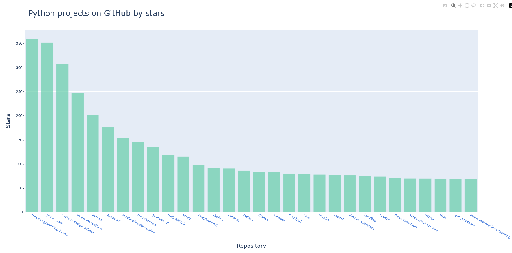

# python_star_analysis

project that fetches the most starred python repositores from github and
visualizes them using plotly

## Features

- fetches top python repositories using an API call to GitHub's API
- Displays repository name, stars, description, and links in a bar chart

## Usage

Run the program using:
python python_repos_visual.py

## Demo



## Requirements

- Python 3.10+
- `requests`
- `plotly`
- `pandas`

Install dependencies with:

```bash
pip install -r requirements.txt